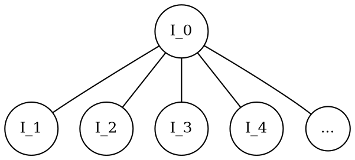
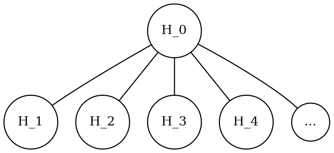

# **基本概念**

- [利益](#利益)
    - [利益作为社会资源](#利益作为社会资源)
        - [定义](#定义)
        - [货币的特殊角色](#货币的特殊角色)
    - [利益的细分](#利益的细分)
        - [细分类别](#细分类别)
        - [利益细分示意图](#利益细分示意图)
    - [上层利益的加权平均](#上层利益的加权平均)
        - [定义总利益和个别利益](#定义总利益和个别利益)
        - [权重计算](#权重计算)
        - [利益加权和](#利益加权和)
    - [资源的修饰](#资源的修饰)
        - [资源修饰示例](#资源修饰示例)
- [偏好](#偏好)
    - [基本定义](#基本定义)
    - [偏好的细分](#偏好的细分)
    - [定义偏好及其总和](#定义偏好及其总和)
    - [权重的计算](#权重的计算)
    - [计算综合偏好](#计算综合偏好)
- [个体](#个体)
    - [个体的表示](#个体的表示)
        - [基本表示](#基本表示)
        - [矩阵表示](#矩阵表示)
    - [列向量表示](#列向量表示)
        - [即得利益和偏好的列向量](#即得利益和偏好的列向量)
        - [维度表示简写](#维度表示简写)
    - [语法糖（表示简化）](#语法糖表示简化)
        - [语法糖1](#语法糖1)
        - [语法糖2](#语法糖2)
        - [语法糖3](#语法糖3)
- [群体](#群体)
    - [群体的表示](#群体的表示)
- [需求](#需求)
    - [需求的表示](#需求的表示)
        - [群体利益总和](#群体利益总和)
        - [个体需求定义](#个体需求定义)
    - [需求的列向量表示](#需求的列向量表示)
        - [个体需求列向量](#个体需求列向量)
        - [资源需求简写](#资源需求简写)
- [预期](#预期)
    - [预期的表示](#预期的表示)
        - [群体利益与货币的比值](#群体利益与货币的比值)
        - [无量纲的数值表示](#无量纲的数值表示)
    - [预期向量的表示](#预期向量的表示)
- [相互作用](#相互作用)
    - [相互作用的表示](#相互作用的表示)
- [阶级](#阶级)
    - [阶级的表示](#阶级的表示)
- [秩序](#秩序)
    - [秩序的表示](#秩序的表示)

---

# 利益

## 1. 利益作为社会资源

### 1.1. 定义
利益 $I$ 代表一切可占有或可交易的社会资源，包括物质财富、权力、知识、社会地位等。

### 1.2. 货币的特殊角色
存在一种特殊的社会资源，作为一般等价物，可以用来交换任何其他资源，这种资源称为货币，用 $I_{cur}$ 表示。

## 2. 利益的细分

### 2.1. 细分类别
利益可以进一步细分为更具体的类别，如物质财富可细分为资产、债务、现金流等，每种都可以进一步细分。

### 2.2. 利益细分示意图
以下是利益细分的示意图：



## 3. 上层利益的加权平均

### 3.1. 定义总利益和个别利益
$I_{总}$ 表示同一上层利益下的总利益，是所有单独利益类型之和，即 $I_T = \sum_{i} I_i$。

### 3.2. 权重计算
每种利益类型 $I_i$ 的权重 $w_i$ 定义为其在总利益中的占比：$ w_i = \frac{I_i}{I_T} $。

### 3.3. 利益加权和
更高层级的综合利益 $I_{综合}$ 计算为不同利益类型的加权和：
$$ I_{综合} = \sum_{i} w_i \cdot I_i = \sum_{i} \frac{{I_i}^2}{I_T} $$

## 4. 资源的修饰

### 4.1. 资源修饰示例
以下是一个Python类示例，用于修饰资源，说明其特定属性：

```python
class Resource:
    def __init__(self, name, categories, attributes=None):
        self.name = name  # 资源名称
        self.categories = categories  # 资源类别列表
        self.attributes = attributes if attributes is not None else {}

    def add_category(self, category):
        if category not in self.categories:
            self.categories.append(category)

    def add_attribute(self, key, value):
        self.attributes[key] = value

    def get_attribute(self, key):
        return self.attributes.get(key, None)

    def __str__(self):
        return f"Resource(name={self.name}, categories={self.categories}, attributes={self.attributes})"
```


为了改进Markdown文段的逻辑结构并使用标题标注各部分内容，我进行了以下调整：

---

# 偏好

## 1. 基本定义

### 1.1. 偏好表示
偏好 $H$ 表示为一个自然数，表示对某种利益的重视程度或优先级。

### 1.2. 偏好的细分
偏好与利益类似，可以进一步细分。以下是偏好细分的示意图：



## 2. 定义偏好及其总和

### 2.1. 偏好总和
对于每种利益类型的偏好 $H_i$，所有偏好的总和 $H_{T}$ 由下式计算：
$$ H_{T} = \sum_{i} H_i $$

## 3. 权重的计算

### 3.1. 权重定义
权重 $w_i$ 基于每种偏好类型 $H_i$ 在所有偏好中的相对比例确定：
$$ w_i = \frac{H_i}{H_{T}} $$

## 4. 计算综合偏好

### 4.1. 综合偏好的计算方法
综合偏好 $H_{综合}$ 通过这些偏好的加权平均计算得出：
$$ H_{综合} = \sum_{i} w_i \cdot H_i = \sum_{i} \frac{{H_i}^2}{H_{T}} $$

这里 $H_i$ 表示第 $i$ 种利益的偏好，$w_i$ 是根据偏好比例计算出的权重。

为了改进Markdown文段的逻辑结构并使用标题标注各部分内容，以下是经过调整的文档结构：

---

# 个体

## 1. 个体的表示

### 1.1. 基本表示
个体 $P$ 表示为若干表示同层次即得利益与偏好的二元组列表，例如：
$$ P = [(I_{物质财富},H_{物质财富}),\ (I_{权力},H_{权力}),\ (I_{知识},H_{知识}),\ ...] $$

### 1.2. 矩阵表示
个体也可以理解为一个矩阵，例如：
$$ P = 
\begin{bmatrix} 
I_{物质财富} & H_{物质财富}\\
I_{权力} & H_{权力}\\
I_{知识} & H_{知识}\\
... & ...\\
\end{bmatrix} $$
或其转置。

## 2. 列向量表示

### 2.1. 即得利益和偏好的列向量
规定 $I(P)$ 表示个体 $P$ 即得利益的列向量，$H(P)$ 表示个体 $P$ 偏好的列向量。在指代明确的特殊语境下，可以简写为 $I$ 和 $H$。

### 2.2. 维度表示简写
规定 $I(P)[x]$ 等价于个体 $P$ 的即得利益 $I_x$，$H(P)[x]$ 等价于个体 $P$ 的偏好 $H_x$。在指代明确的特殊语境下，可以简写为 $I[x]$ 和 $H[x]$。

## 3. 语法糖（表示简化）

### 3.1. 语法糖1
精简 $I$ 和 $H$ 的运算表示，以 $I$ 为例：
$$ I(P_0)[x] + I(P_1)[x] + I(P_2)[x] + ...$$ 
等价于 
$$ I(<P_0 + P_1 + P_2 + ...>)[x] $$
其中 $+$ 可以替换为任意的二元运算符，只要运算存在定义。

### 3.2. 语法糖2
精简 $I$ 和 $H$ 的运算表示，以 $I$ 为例：
$$ I(P)[x] + I(P)[y] + I(P)[z] + ... $$
等价于
$$ I(P)[<x + y + z + ...>] $$
其中 $+$ 可以替换为任意的二元运算符，只要运算存在定义。

### 3.3. 语法糖3
对个体 $P$ 的某维度 $x$ 的数值运算或数值表示的简化：
$$ A(P)[x] = B(P)[x] + C(P)[x] + ... $$ 
等价于
$$ A(P)[x] = <B + C + ...>(P)[x] $$
其中 $+$ 可以替换为任意的二元运算符，只要运算存在定义。

---

# 群体

## 1. 群体的表示

### 1.1. 个体集合
群体 $G$ 由个体集合组成，可以用集合的方式表示，例如：
$$ G = \{ P_0, P_1, P_2, ..., P_n \} $$

---

# 需求

## 1. 需求的表示

### 1.1. 群体利益总和
群体 $G$ 中某项利益的总和 $I(G)[x]$ 定义为：
$$ I(G)[x] = \sum_{i=0}^{|G|} I(P_i)[x],\ P_i \in G $$
或者使用语法糖表示为：
$$ I(G)[x] = I(< \sum_{i=0}^{|G|} P_i >)[x],\ P_i \in G $$
这里 $I(G)[x]$ 表示群体中个体利益 $x$ 的总和，$|G|$ 表示群体大小。

### 1.2. 个体需求定义
个体 $P$ 在某项利益 $x$ 上的需求 $D(P)[x]$ 定义为群体利益总和与个体利益比值的平均：
$$ D(P)[x] = \frac{{I(G)[x]}}{I(P)[x] \cdot |G|},\ P \in G $$

## 2. 需求的列向量表示

### 2.1. 个体需求列向量
规定 $D(P)$ 表示个体 $P$ 的需求列向量，指代明确时可以简写为 $D$，表示为：
$$ D(P) = [ D[x],\ D[y],\ D[z],\ ... ] $$

### 2.2. 资源需求简写
规定 $D(P)[x]$ 等价于个体 $P$ 关于资源 $x$ 的需求 $D_x$，在指代明确的特殊语境下，可以简写为 $D[x]$。

---

# 预期

## 1. 预期的表示

### 1.1. 群体利益与货币的比值
在群体 $G$ 中，某项利益 $x$ 的预期 $Exp(G)[x]$ 用一般等价物 $cur$ 的平均衡量，即：
$$ Exp(G)[x] = \frac{I(G)[x]}{I(G)[cur]} $$
当群体指代明确时，可以简写为 $Exp[x]$。

### 1.2. 无量纲的数值表示
某项具体预期是一个无量纲的数值，反映了群体对某项利益的平均价值预期。

## 2. 预期向量的表示

### 2.1. 群体预期向量
$Exp(G)$ 能够表示群体 $G$ 的预期列表，也是一个向量：
$$ Exp(G) = [Exp[x],\ Exp[y],\ Exp[z],\ ...] $$

---

# 相互作用

## 1. 相互作用的表示

### 1.1. 相互作用的定义
相互作用，表示为 $F$，包括不同个体之间、不同群体之间以及个体与群体之间的利益交换，且这些交换不违背基本原则。

---

# 阶级

## 1. 阶级的表示

### 1.1. 基于利益乘积的定义
阶级，表示为 $C$，是基于至少在物质财富、权力、知识这三个维度上的利益综合量化而成，通常量化为这些维度利益的乘积，即：
$$ C(P) = I(P)[物质财富] \cdot I(P)[权力] \cdot I(P)[知识] $$

### 1.2. 扩展阶级定义
阶级的定义可以扩展到更多的维度，包括以上提到的三个维度以及其他可能的维度，形式如下：
$$ C(P) = I(P)[物质财富] \cdot I(P)[权力] \cdot I(P)[知识] \cdot ... $$

---

# 秩序

## 1. 秩序的表示

### 1.1. 定义
秩序，表示为 $O$，指的是阶级内部除了基本原则外新建立的相互作用法则。这些法则应符合绝大多数阶级内部个体增长的情况，以促进阶级内部的和谐与发展。
