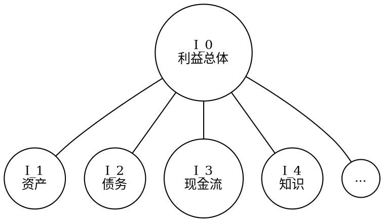
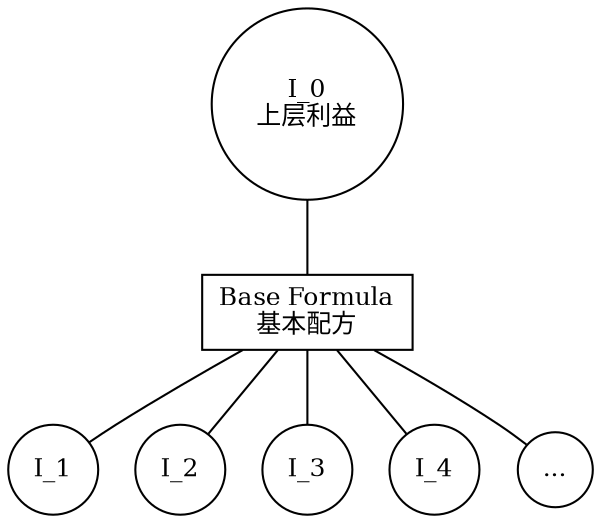
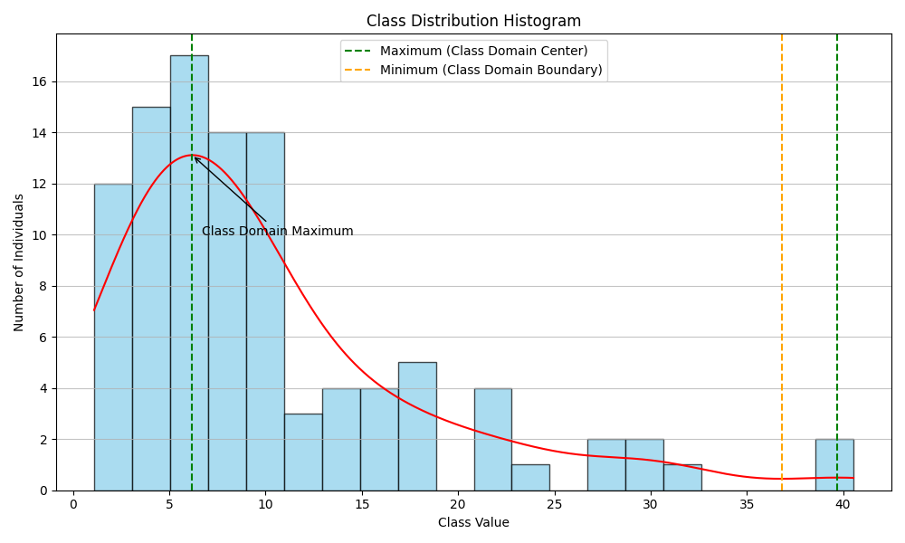

# **基本概念**

- [利益](#利益)
    - [利益作为社会资源](#1-利益作为社会资源)
        - [定义](#11-定义)
        - [货币的特殊角色](#12-货币的特殊角色)
    - [利益的细分](#2-利益的细分)
        - [细分类别](#21-细分类别)
        - [利益细分示意图](#22-利益细分示意图)
    - [配方与调整机制](#3-配方与调整机制)
        - [基本配方理论极限](#31-基本配方理论极限)
            - [配方定义](#311-配方定义)
        - [个体配方调整机制](#32-个体配方调整机制)
            - [配比调整模拟](#321-配比调整模拟)
            - [配比参数设定](#322-配比参数设定)
        - [配方调整的数学表示](#33-配方调整的数学表示)
            - [下层利益最低比例要求](#331-下层利益最低比例要求)
            - [个体配比的计算](#332-个体配比的计算)
        - [方向性](#34-方向性)
            - [交易获取上层利益](#341-交易获取上层利益)
            - [上层利益拆解](#342-上层利益拆解)
    - [资源的修饰](#4-资源的修饰)

- [偏好](#偏好)
    - [基本定义](#1-基本定义)
        - [偏好表示](#11-偏好表示)

- [个体](#个体)
    - [个体的表示](#1-个体的表示)
        - [基本表示](#11-基本表示)
        - [矩阵表示](#12-矩阵表示)
    - [列向量表示](#2-列向量表示)
        - [即得利益和偏好的列向量](#21-即得利益和偏好的列向量)
        - [维度表示简写](#22-维度表示简写)
    - [语法糖（表示简化）](#3-语法糖表示简化)
        - [语法糖1](#31-语法糖1)
        - [语法糖2](#32-语法糖2)
        - [语法糖3](#33-语法糖3)

- [群体](#群体)
    - [群体的表示](#1-群体的表示)
        - [个体集合](#11-个体集合)

- [需求](#需求)
    - [需求的表示](#1-需求的表示)
        - [群体利益总和](#11-群体利益总和)
        - [个体需求定义](#12-个体需求定义)
        - [三元组表示](#13-三元组表示)
        - [扩展矩阵表示](#14-扩展矩阵表示)
    - [需求的列向量表示](#2-需求的列向量表示)
        - [个体需求列向量](#21-个体需求列向量)
        - [资源需求简写](#22-资源需求简写)

- [预期](#预期)
    - [预期的表示](#1-预期的表示)
        - [群体利益与货币的比值](#11-群体利益与货币的比值)
        - [无量纲的数值表示](#12-无量纲的数值表示)

- [交易](#交易)
    - [交易的表示](#1-交易的表示)

- [阶级](#阶级)
    - [阶级的表示](#1-阶级的表示)
        - [基于利益乘积的定义](#11-基于利益乘积的定义)
        - [扩展阶级定义](#12-扩展阶级定义)
        - [阶级域的分析](#13-阶级域的分析)
            - [阶级分布的直方图](#131-阶级分布的直方图)
            - [函数拟合与极值分析](#132-函数拟合与极值分析)
            - [阶级域的识别](#133-阶级域的识别)

- [秩序](#秩序)
    - [秩序的表示](#1-秩序的表示)
        - [定义](#11-定义)
    - [作用方式和原理](#2-作用方式和原理)
        - [共享中心值的原则](#21-共享中心值的原则)
        - [规则的权重与代价机制](#22-规则的权重与代价机制)

---

# 利益

## 1. 利益：社会资源

### 1.1. 定义
利益 \(I\) 代表一切可占有或可交易的社会资源。这些资源涵盖了物质财富、权力、知识、社会地位等各个层面，反映了个体或集体在社会中所能够掌握和使用的资源总和。由此可见，利益是物质资源 \(R\) 的超集，包括了除物质资源外的其他形式资源，如非物质资源和社会资本等。

```python
class Interest(Resource):
    def __init__(self, name, amount=0, base_formula=None):
        """
        :param name: 利益的名称
        :param amount: 利益的具体数值
        :param base_formula: 利益对应的基本配方（可选）
        """
        self.name = name
        self.amount = amount
        self.base_formula = base_formula # 后文补充这一概念的定义
```

### 1.2. 货币的特殊角色
货币在所有社会资源中扮演着一种特殊的角色。它作为一般等价物，具备了与其他任何资源交换的能力。这种资源被特别标记为 \(I_{cur}\)。货币的这一特性极大地简化了交易过程，促进了资源的流动和分配，是现代经济体系的基石。

## 2. 利益的细分

### 2.1. 细分类别
利益的范畴十分广泛，可以根据其性质和功能进一步细分为更具体的类别。例如，物质财富可以细分为资产、债务、现金流等，而每一种又可以依据具体的特征和形态被进一步细分。这种细分有助于更准确地理解和分析利益的结构和动态，为决策提供更精细化的依据。

### 2.2. 利益细分示意图
为了更直观地理解利益的细分，以下提供了一个示意图。在这个图中，利益 \(I_0\) 被分解为多个子类别 \(I_1, I_2, I_3, I_4, ...\)，每个子类别又可能包含更多的细分。这种层次化的结构有助于揭示利益的多维度特性和复杂性。



通过这种方式，我们可以清晰地看到不同类型的利益如何从总体中分化出来，并理解各自的特点和相互之间的联系。这为深入分析利益的结构和动态提供了一个有力的工具。

## 3. 配方与调整机制

### 3.1. 基本配方理论极限

#### 3.1.1. 配方定义
在这个框架中，每一种上层利益的构成都可以通过一种“基本配方”来定义。这个配方明确了构成该上层利益所需的各种下层利益及其最低比例要求。这一概念有助于我们理解和量化各种利益之间的构成关系和相互依赖。


```python
class Formula:
    def __init__(self, inputs, output):
        """
        :param inputs: 输入利益及其权重，格式为[(Interest, weight), ...]
        :param output: 输出利益及数量，格式为(Interest, amount)
        """
        self.inputs = inputs
        self.output = output

    def can_apply(self, individual):
        """
        检查个体是否有足够的利益来应用这个配方
        :param individual: 个体实例
        :return: bool
        """
        # 实现细节：遍历inputs，确保个体有足够的对应利益
        pass
```

### 3.2. 个体配方调整机制

#### 3.2.1. 配比调整模拟
个体在特定情况下可能会调整自己的利益配比，以适应特定的需求或目标。这种调整可以通过截断的正态分布来模拟，允许个体在基本配方的基础上进行个性化的微调。

#### 3.2.2. 配比参数设定
在这个模型中，基本配方中的比例（即下层利益在上层利益中的比例）被视为正态分布的均值（μ）。个体具体的利益（如知识水平、技术能力等）可以通过某种映射函数转化为标准差（σ），从而影响个体的利益配比。

### 3.3. 配方调整的数学表示

#### 3.3.1. 下层利益最低比例要求
基本配方中规定了每种下层利益 \(I_i\) 的最低比例要求 \(p_i\)。这是确保上层利益能够成功构成的最低标准。

#### 3.3.2. 个体配比的计算
个体的具体配比 \(p_i'\) 由截断的正态分布决定，其公式如下：
$$ p_i' \sim \text{TruncatedNormal}(\mu = p_i, \sigma, \text{lower} = p_i, \text{upper} = +\infin ) $$ 

其中，下限为 \(p_i\)，确保个体的配比不会低于基本配方的要求，而上限则可以是无穷大，以反映在特定条件下，个体可能会超出最低要求。

### 3.4. 方向性

#### 3.4.1. 交易获取上层利益
此模型允许个体通过市场交易来获取他们无法直接合成的上层利益。这一点强调了交易在资源分配和利益获取中的关键作用。

#### 3.4.2. 上层利益拆解
在需要将上层利益拆解为下层利益进行交易或评估时，如果个体配方中的某些比例无法确定（即为无穷大），则使用基本配方中的标准比例进行计算。这确保了即使在缺乏完整个体配比信息的情况下，也能够进行合理的评估和交易。

## 4. 资源的修饰

### 4.1. 资源修饰示例
以下是一个Python类示例，用于修饰资源，说明其特定属性：

```python
class Resource:
    def __init__(self, name, categories, attributes=None):
        self.name = name  # 资源名称
        self.categories = categories  # 资源类别列表
        self.attributes = attributes if attributes is not None else {}

    def add_category(self, category):
        if category not in self.categories:
            self.categories.append(category)

    def add_attribute(self, key, value):
        self.attributes[key] = value

    def get_attribute(self, key):
        return self.attributes.get(key, None)

    def __str__(self):
        return f"Resource(name={self.name}, categories={self.categories}, attributes={self.attributes})"
```

---

# 偏好

## 1. 基本定义

### 1.1. 偏好表示
偏好 \(H\) 用以量化个体或集体对不同类型利益的重视程度或优先级。它表示为一个自然数，其中较大的数值表示更高的偏好级别。这种量化方法使得我们可以清晰地理解和比较不同利益之间的相对重要性，并据此做出选择或决策。

```python
class Preference:
    def __init__(self, preferences=None):
        self.preferences = preferences if preferences is not None else {}
```

---

# 个体

## 1. 个体的表示

### 1.1. 基本表示
个体 \(P\) 由一系列二元组构成，每个二元组代表一个特定利益及其对应的偏好级别。这种表示方法使得我们可以快速识别个体在不同领域的利益及其重视程度，为进一步的分析和研究提供了基础。示例如下：
$$ P = [(I_{物质财富},H_{物质财富}),\ (I_{权力},H_{权力}),\ (I_{知识},H_{知识}),\ ...] $$

### 1.2. 矩阵表示
个体也可以以矩阵的形式表示，这种表示方法在处理复杂数据或进行数学运算时尤为方便。矩阵的每一行代表一个特定的利益及其偏好级别，使得我们可以高效地处理和分析个体的属性。示例如下：
$$ P = \begin{bmatrix} 
I_{物质财富} & H_{物质财富}\\
I_{权力} & H_{权力}\\
I_{知识} & H_{知识}\\
... & ...\\
\end{bmatrix} $$ 
该矩阵也可进行转置以适应不同的分析需求。

## 2. 列向量表示

### 2.1. 即得利益和偏好的列向量
为了更方便地进行数学运算和分析，个体的即得利益和偏好可分别表示为列向量 \(I(P)\) 和 \(H(P)\)。这种表示方法将个体的所有利益和偏好纳入统一的框架，便于进行向量运算和数据处理。

### 2.2. 维度表示简写
在分析和计算中，我们经常需要引用个体在特定维度上的利益或偏好。为了简化表示，我们规定 \(I(P)[x]\) 代表个体 \(P\) 在利益 \(I_x\) 上的值，\(H(P)[x]\) 代表个体在偏好 \(H_x\) 上的值。在上下文明确的情况下，这些表示可以进一步简写为 \(I[x]\) 和 \(H[x]\)，从而提高分析效率。

个体代码实现示例：

```python
class Individual:
    def __init__(self, interests=None, preferences=None):
        """
        :param interests: 个体拥有的利益，格式为{Interest: amount, ...}
        :param preferences: 个体的偏好，格式为{Interest: preference_level, ...}
        """
        self.interests = interests if interests else {}
        self.preferences = preferences if preferences else {}

    def can_synthesize(self, interest):
        """
        判断这个个体是否能合成指定的利益
        :param interest: 想要合成的目标利益
        :return: bool
        """
        if not interest.base_formula:
            return False  # 如果没有基本配方，无法合成
        # 实现细节：使用interest.base_formula来判断
        pass

    def to_matrix(self):
        """
        转换个体的利益和偏好到矩阵表示
        :return: numpy array
        """
        # 转换为矩阵表示
        pass

    def from_matrix(self, matrix):
        """
        从矩阵表示恢复个体的利益和偏好
        :param matrix: numpy array
        """
        # 从矩阵表示恢复
        pass
```

## 3. 语法糖（表示简化）

### 3.1. 语法糖1
为了简化个体利益 \(I\) 的运算表示，引入以下语法糖。当需要对同一维度 \(x\) 上多个个体的利益进行运算时，可以将运算直接应用于个体的集合上，而不是逐一对每个个体的利益进行运算。例如，若要对个体 \(P_0, P_1, P_2, ...\), 在维度 \(x\) 上的利益进行累加，可以简写为：
$$ I(P_0)[x] + I(P_1)[x] + I(P_2)[x] + ...$$ 
等价于 
$$ I(<P_0 + P_1 + P_2 + ...>)[x] $$ 
这里的 \(+\) 表示二元运算符，可以根据需要替换为其他运算符，前提是该运算在此上下文中有明确的定义。

### 3.2. 语法糖2
同样地，为了简化对单一个体 \(P\) 在不同维度 \(x, y, z, ...\), 上利益的运算表示，提出以下语法糖。可以将多个维度上的运算简写为对维度标识符的运算，如：
$$ I(P)[x] + I(P)[y] + I(P)[z] + ... $$ 
等价于
$$ I(P)[<x + y + z + ...>] $$ 
这里的 \(+\) 同样代表二元运算符，可以根据具体情况替换为其他适当的运算符。

### 3.3. 语法糖3
为了进一步简化对个体 \(P\) 的某一维度 \(x\) 上的数值运算表示，引入以下语法糖。当维度 \(x\) 上的值是由多个来源 \(B, C, ...\), 累加（或进行其他二元运算）得到时，可以将这些来源直接作为运算对象：
$$ A(P)[x] = B(P)[x] + C(P)[x] + ... $$ 
等价于
$$ A(P)[x] = <B + C + ...>(P)[x] $$ 
这里 \(+\) 表示二元运算符，根据需要可替换为其他运算符。

---

# 群体

## 1. 群体的表示

### 1.1. 个体集合
群体 \(G\) 由若干个体组成，可以用集合的方式来表示，其中每个个体都是群体的一个元素。例如：
$$ G = \{ P_0, P_1, P_2, ..., P_n \} $$

在这里，每个 \(P_i\) 代表一个个体，它们共同构成了一个群体。群体的特性和行为是由所有个体的利益和偏好的综合来决定的。在实现上，群体可以通过一个`Group`类来表示，其中包含一个个体的集合。示例如下：

```python
class Group:
    def __init__(self):
        self.members = set()

    def add_member(self, individual):
        """向群体中添加个体"""
        self.members.add(individual)

    def remove_member(self, individual):
        """从群体中移除个体"""
        self.members.discard(individual)

    def total_interests(self):
        """计算群体的总利益"""
        # 实现细节：遍历所有成员，累加其利益

    def total_preferences(self):
        """计算群体的总偏好"""
        # 实现细节：遍历所有成员，累加其偏好
```

通过这种方式，群体的表示不仅清晰定义了群体和个体之间的关系，还为进一步分析群体内部的互动和动态提供了基础。

---

# 需求

## 1. 需求的表示

### 1.1. 群体利益总和
群体中某项利益的总和是群体所有成员在该项利益上的值的累加。例如，群体 \(G\) 中某项利益 \(x\) 的总和 \(I(G)[x]\) 可以表示为：
$$ I(G)[x] = \sum_{i=0}^{|G|} I(P_i)[x],\ P_i \in G $$
这里，\(I(G)[x]\) 表示群体中关于利益 \(x\) 的总和，\(P_i\) 代表群体中的一个个体，而 \(|G|\) 代表群体的成员总数。

使用语法糖可以将其简化为：
$$ I(G)[x] = I(< \sum_{i=0}^{|G|} P_i >)[x],\ P_i \in G $$
这种表示方式简化了群体利益总和的计算，使得其更加直观。

### 1.2. 个体需求定义
个体在某项利益上的需求是根据个体利益与群体利益总和的关系来定义的。具体地说，个体 \(P\) 在利益 \(x\) 上的需求 \(D(P)[x]\) 可以定义为：
$$ D(P)[x] = \frac{{I(G)[x]}}{I(P)[x] \cdot |G|},\ P \in G $$
这里，\(D(P)[x]\) 表示个体 \(P\) 关于利益 \(x\) 的需求。这个公式反映了群体中该项利益的平均分配与个体当前拥有的该项利益之间的比值。

```python
class Demand:
    def __init__(self, individual, groups):
        """
        :param individual: 需求计算所基于的个体实例
        :param groups: 包含该个体的群体集合
        """
        self.individual = individual
        self.groups = groups
        self.demands = self.calculate_demands()

    def calculate_demands(self):
        """
        根据个体所属的群体集合计算各种利益的需求。
        :return: 一个字典，格式为{利益名: 需求水平, ...}
        """
        pass
```

### 1.3. 三元组表示

个体 \(P\) 现在可以由一系列三元组构成，每个三元组代表一个特定利益、其对应的偏好级别，以及该利益的需求水平。这种表示方法不仅显示了个体在不同领域的利益及其重视程度，还包括了基于所属群体的需求水平，为分析和研究提供了更全面的基础。示例如下：

$$ P = [(I_{物质财富}, H_{物质财富}, D_{物质财富}),\ (I_{权力}, H_{权力}, D_{权力}),\ (I_{知识}, H_{知识}, D_{知识}),\ ...] $$

```python
class Individual:
    def __init__(self, interests=None, preferences=None, groups=None):
        """
        :param interests: 个体拥有的利益，格式为{利益名: 数量, ...}
        :param preferences: 个体的偏好，格式为{利益名: 偏好级别, ...}
        :param groups: 个体所属的群体集合
        """
        self.interests = interests if interests else {}
        self.preferences = preferences if preferences else {}
        self.groups = groups if groups else set()
        self.demands = None  # 需求将通过 Demand 类计算得到

    def update_demands(self):
        """
        使用 Demand 类更新个体的需求水平。
        """
        self.demands = Demand(self, self.groups).demands
```

### 1.4. 扩展矩阵表示

个体的扩展矩阵表示法可以包含三个维度：利益、偏好级别和需求水平。每一行代表一个特定的利益，每一行的三个元素分别对应于该利益的量、偏好级别以及需求水平。这种表示法在处理复杂数据或进行数学运算时特别方便，使得我们可以高效地处理和分析个体的多维属性。示例如下：

$$ P = \begin{bmatrix} 
I_{物质财富} & H_{物质财富} & D_{物质财富} \\
I_{权力} & H_{权力} & D_{权力} \\
I_{知识} & H_{知识} & D_{知识} \\
... & ... & ... \\
\end{bmatrix} $$ 

## 2. 需求的列向量表示

### 2.1. 个体需求列向量
个体的需求可以表示为一个列向量，其中包含了个体对所有利益的需求值：
$$ D(P) = [ D[x],\ D[y],\ D[z],\ ... ] $$
这个向量提供了一个全面的视角，展示了个体在各个利益方面的需求程度。

### 2.2. 资源需求简写
为了简化表示，个体 \(P\) 关于资源 \(x\) 的需求 \(D_x\) 可以简写为 \(D(P)[x]\)。在上下文明确的情况下，进一步简化为 \(D[x]\)。

---

# 预期

## 1. 预期的表示

### 1.1. 群体利益与货币的比值
在群体 \(G\) 中，对于某项利益 \(x\)，其预期 \(Exp(G)[x]\) 表示为与一般等价物（通常是货币，记作 \(cur\)）的比值。这个比值计算了群体中该项利益与货币之间的平均关系，公式如下：
$$ Exp(G)[x] = \frac{I(G)[x]}{I(G)[cur]} $$
这里，\(I(G)[x]\) 表示群体中利益 \(x\) 的总量，而 \(I(G)[cur]\) 则是群体中货币的总量。当群体指代明确时，预期可以简写为 \(Exp[x]\)。

```python
class Group:
    def __init__(self):
        self.members = set()
        self.total_interests = {}
        self.expectations = {}  # 群体的预期

    def update_expectations(self, currency):
        """
        根据群体中的利益总和和货币量更新预期。
        :param currency: 用作一般等价物的利益名称
        """
        if currency in self.total_interests and self.total_interests[currency] > 0:
            for interest, total in self.total_interests.items():
                self.expectations[interest] = total / self.total_interests[currency]
        else:
            # 处理货币量为0的情况
            pass

    def add_member(self, individual):
        # 处理成员加入，同时更新成员状态
        self.members.add(individual)
        self.update_member_states()

    def update_member_states(self):
        # 更新成员状态的具体实现
        pass
```

### 1.2. 无量纲的数值表示
预期 \(Exp(G)[x]\) 是一个无量纲的数值，它反映了群体对某项利益相对于一般等价物的平均价值预期。这个比值使得不同利益之间的价值预期可以进行比较和分析，无论这些利益的本质和量度如何。

## 2. 预期向量的表示

### 2.1. 群体预期向量
群体 \(G\) 的预期列表可以表示为一个向量 \(Exp(G)\)，其中包含了群体对所有利益相对于一般等价物的价值预期。这个向量形式允许我们系统地分析和比较群体对不同利益的价值预期，公式如下：
$$ Exp(G) = [Exp[x],\ Exp[y],\ Exp[z],\ ...] $$
这里，每个 \(Exp[x]\)、\(Exp[y]\)、\(Exp[z]\) 等代表了群体对特定利益 \(x\)、\(y\)、\(z\) 等的价值预期。

---

# 交易

## 1. 交易的表示

### 1.1. 交易的定义
交易，表示为 \(Tr\)，是一个过程，其中参与方（可以是个体之间、群体之间，或个体与群体之间）相互交换各自的利益。这种交换基于双方或多方之间的共识，并遵循一定的原则和规则。交易的基本形式可以表示为：

$$ Tr = \{(P_i, I_i, Q_i), (P_j, I_j, Q_j)\} $$

这里：

- \(P_i\) 和 \(P_j\) 分别代表交易中的参与个体或群体。
- \(I_i\) 和 \(I_j\) 分别代表这些参与方提供的利益。
- \(Q_i\) 和 \(Q_j\) 分别代表交换的利益数量。

交易的核心在于价值的互换，即参与方之一提供某种利益，以换取另一方的另一种利益。基本示例如下：

```python
class Transaction:
    def __init__(self, participant_a, interest_a, quantity_a, participant_b, interest_b, quantity_b):
        """
        初始化交易实例。
        :param participant_a: 参与方A，可以是个体或群体的实例。
        :param interest_a: 参与方A提供的利益类型。
        :param quantity_a: 参与方A提供的利益数量。
        :param participant_b: 参与方B，可以是个体或群体的实例。
        :param interest_b: 参与方B提供的利益类型。
        :param quantity_b: 参与方B提供的利益数量。
        """
        self.participant_a = participant_a
        self.interest_a = interest_a
        self.quantity_a = quantity_a
        self.participant_b = participant_b
        self.interest_b = interest_b
        self.quantity_b = quantity_b

    def execute(self):
        """
        执行交易，更新参与方的利益。
        """
        # 更新参与方A的利益
        self.participant_a.interests[self.interest_a] -= self.quantity_a
        self.participant_a.interests[self.interest_b] = self.participant_a.interests.get(self.interest_b, 0) + self.quantity_b

        # 更新参与方B的利益
        self.participant_b.interests[self.interest_b] -= self.quantity_b
        self.participant_b.interests[self.interest_a] = self.participant_b.interests.get(self.interest_a, 0) + self.quantity_a
```

---

# 阶级

## 1. 阶级的表示

### 1.1. 基于利益乘积的定义
阶级 \(C\) 是根据个体在关键维度（如物质财富、权力、知识等）上的利益综合得到的量化指标。这些维度被认为是决定个体社会地位的关键因素。个体 \(P\) 的阶级 \(C(P)\) 通常通过计算这些维度上的利益乘积来量化，例如：
$$ C(P) = I(P)[物质财富] \cdot I(P)[权力] \cdot I(P)[知识] $$
这里，\(I(P)[物质财富]\)、\(I(P)[权力]\) 和 \(I(P)[知识]\) 分别表示个体在物质财富、权力和知识这三个维度上的利益。阶级的这种表示反映了个体在这些关键维度上利益的综合水平。

### 1.2. 扩展阶级定义
阶级的定义可以根据不同的分析需求扩展到更多的维度，以包括除物质财富、权力、知识之外的其他维度，如社会地位、技能等。扩展后的阶级定义可以形式化为：
$$ C(P) = I(P)[物质财富] \cdot I(P)[权力] \cdot I(P)[知识] \cdot ... $$
这里，“...”代表其他可能的维度。通过这种方式，阶级的计算考虑了个体在多个关键维度上的利益，为分析个体的社会地位提供了一个更全面的量化指标。

```python
class Individual:
    def __init__(self, interests=None, preferences=None):
        """
        ...
        :param classification: 个体的阶级值
        """
        # 其他初始化代码
        self.classification = self.calculate_classification()  # 计算并存储个体的阶级

    def calculate_classification(self):
        """
        计算个体的阶级，基于关键维度利益的乘积。
        :return: 阶级值
        """
        # 计算阶级值
        pass
```

### 1.3. 阶级域的分析

#### 1.3.1. 阶级分布的直方图

我们首先以全体个体集合 \(\Omega\) 中的每个个体阶级值为基础，构建一个直方图。该直方图描绘了不同阶级区间内个体数量的分布情况，从而反映了整个群体的阶级分布特征。

#### 1.3.2. 函数拟合与极值分析

为了进一步分析阶级分布，我们将直方图数据拟合为一个或多个数学函数。这一步骤的目标是找到能够准确描述阶级分布特征的数学模型。通过对拟合函数进行数学分析，尤其是寻找函数的极大值点及其周边区域，我们能够识别出群体中的主要阶级集群。每个极大值点及其领域代表了群体中一个显著的阶级集中趋势，这些趋势定义了群体内的“阶级域”。

#### 1.3.3. 阶级域的识别

通过对拟合函数的极值分析，我们可以将群体中的阶级分解为若干个“阶级域”，每个阶级域由一个极大值及其领域组成。这些阶级域揭示了群体内部最为显著的阶级聚集现象，如某些特定阶级的个体可能在群体中占据多数，形成明显的阶级集中区域。

示例代码：
```python
# 生成100个个体的阶级数据（这里简化使用随机数模拟）
np.random.seed(0)  # 确保每次运行生成的数据一致
class_values = np.random.lognormal(mean=2.0, sigma=0.75, size=100)

# 构建直方图
plt.figure(figsize=(10, 6))
plt.hist(class_values, bins=20, color='skyblue', edgecolor='black', alpha=0.7)
plt.title("Class Distribution Histogram")
plt.xlabel("Class Value")
plt.ylabel("Number of Individuals")
plt.grid(axis='y', alpha=0.75)

# 函数拟合 - 使用核密度估计（KDE）拟合阶级分布
kde = gaussian_kde(class_values)
x_range = np.linspace(min(class_values), max(class_values), 1000)
kde_values = kde(x_range)

# 绘制拟合曲线
plt.plot(x_range, kde_values * len(class_values) * (max(class_values) - min(class_values)) / 20, color='red')  # 调整因子以匹配直方图的高度

# 寻找局部极大值点和局部极小值点
maxima_indices = argrelextrema(kde_values, np.greater)[0]
minima_indices = argrelextrema(kde_values, np.less)[0]
maxima_values = x_range[maxima_indices]
minima_values = x_range[minima_indices]

# 标记极大值点和极小值点
for maximum in maxima_values:
    plt.axvline(x=maximum, color='green', linestyle='--', label='Maximum (Class Domain Center)')
for minimum in minima_values:
    plt.axvline(x=minimum, color='orange', linestyle='--', label='Minimum (Class Domain Boundary)')

plt.annotate('Class Domain Maximum', xy=(maxima_values[0], kde(maxima_values[0]) * len(class_values) * (max(class_values) - min(class_values)) / 20), 
             xytext=(maxima_values[0]+0.5, kde(maxima_values[0]) * len(class_values) * 1.5), arrowprops=dict(facecolor='black', arrowstyle='->'))

# 为避免重复的图例标签，进行去重处理
handles, labels = plt.gca().get_legend_handles_labels()
by_label = dict(zip(labels, handles))
plt.legend(by_label.values(), by_label.keys())

plt.tight_layout()
plt.show()
```


基于上述描述和生成的直方图，我们可以提炼出阶级域的数学表达如下：

1. **阶级分布直方图**：首先，我们用直方图 \(H\) 来表示阶级值的分布情况，其中直方图的每个条形代表特定阶级值区间内的个体数量。直方图的 \(x\) 轴代表阶级值，\(y\) 轴代表相应阶级值区间的个体数量。

2. **核密度估计（KDE）拟合曲线**：使用核密度估计方法对直方图数据进行平滑拟合，得到拟合曲线 \(K(x)\)，其中 \(x\) 为阶级值。\(K(x)\) 提供了关于阶级值分布的连续且平滑的估计。

3. **极值分析**：对拟合曲线 \(K(x)\) 进行极值分析，识别出所有局部极大值点和极小值点。局部极大值点 \(M = \{m_1, m_2, ..., m_k\}\) 表示阶级域中心，而局部极小值点 \(N = \{n_1, n_2, ..., n_l\}\) 代表阶级域边界。

4. **阶级域的定义**：基于局部极小值点作为边界，阶级域可以定义为区间 \((n_i, n_{i+1})\) 内的所有阶级值，每个区间内包含至少一个局部极大值点 \(m_j\) 作为该阶级域的中心。因此，第 \(i\) 个阶级域 \(C_i\) 可以数学上表示为：\[C_i = \{x \in (n_i, n_{i+1}) | K(x) \text{ 在区间内达到局部极大}\}\]

通过这种方式，阶级域的数学表达不仅揭示了群体内部的阶级结构，而且明确了每个阶级域的边界和中心，为进一步分析提供了明确的数学框架。这种表达形式有助于我们从数学角度深入理解和分析群体的阶级分布，以及阶级域内部和阶级域之间的关系。

---

# 秩序

## 1. 秩序的表示

### 1.1. 定义
秩序 \(O\) 代表在特定阶级域内部建立的一组规则和法则，旨在促进该阶级域内部个体的增长和发展，同时保持内部和谐。这些规则和法则不是社会的基本原则，而是根据特定阶级域的特性和需要新建立的。秩序的目的是确保阶级域内部的交易和互动能够促进个体及整个阶级域的利益最大化。

秩序的特点包括：

- **内部导向性**：秩序主要关注于阶级域内部的规范和发展，强调内部成员的互助与合作。
- **利益增长导向**：秩序中的法则和规则旨在促进阶级域内个体的利益增长，支持个体和集体的发展。
- **动态适应性**：秩序能够根据阶级域内部及外部环境的变化进行动态调整和适应，以维持阶级域的稳定和增长。
- **局部适用性**：秩序虽然在特定阶级域内部具有高度的适用性和有效性，但其法则可能不适用于其他阶级域或在其他阶级域中不被重视。

秩序的建立通常涉及以下方面：

- **交易规则**：明确规定阶级域内部交易的方式、条件和限制，以确保交易的公平性和效率。
- **资源分配**：建立资源分配的准则和机制，以公平和高效地分配阶级域内的共享资源，对于阶级域之外不一定公平和高效。

## 2. 作用方式和原理

秩序 \(O\)，是在特定阶级域内建立的一组规则和法则，旨在促进阶级域内部的和谐与集体增长。这些规则是基于阶级域内共享的中心值——该阶级域的极大值点所建立的。

### 2.1. 共享中心值的原则

- **共享中心值**：阶级域内的所有个体共享一个中心值，即该阶级域的极大值点。这一点反映了阶级域内所有个体的平均或代表性地位，并为建立秩序提供了一个共同的基准。
- **秩序维护**：秩序的维护基于共享的中心值，所有阶级域内的个体都应遵循旨在促进整个阶级域利益的规则。违反这些规则的个体需要承担相应的代价，以保证规则的遵守和秩序的稳定。

### 2.2. 规则的权重与代价机制

- **规则权重**：秩序中的规则根据其对阶级域内部和谐与增长的重要性赋予不同的权重，权重和为1。权重越高的规则一旦违反，个体需要付出的代价也越大。
- **代价机制**：违反秩序规则的个体将面临代价，这可能包括资源损失、社会地位下降或其他形式的惩罚。代价的大小与违反规则的权重成正比，以确保秩序的有效性和公正性。
- **距离敏感的代价调整**：违反秩序的代价还受到违反个体所在阶级域与制定规则阶级域之间距离的影响。阶级域之间的距离可以通过阶级域中心值的差异来量化。当违反规则的个体所在的阶级域与制定规则的阶级域距离较远时，违反规则的代价将相应减少。这反映了秩序的局部性原则，即秩序更加注重与其直接相关的阶级域内部的和谐与增长，而对较远阶级域的影响相对较小。

---

# 环境与自然资源

## 1. 地图和环境

### 1.1. 二维网格地图创建
创建一个二维网格地图，每个单元格代表环境中的一个区域，该区域可以包含不同类型的自然资源（如水源、土地、矿产等），以及各种关于地形地貌的基本信息（诸如海拔、湿度、土壤盐碱度等）。


### 1.2. 地图的分层表示
地图的分层表示可以包括自然资源和地形地貌等信息，每一层信息都可以用一个二维数组来表示。

## 2. 自然资源的表示

### 2.1. 资源分布设定
自然资源的初始分布可以基于现实世界的模型进行设置，也可以通过随机生成来模拟不同的环境条件。

---

# 劳动

## 1. 人环交互

### 1.1. 劳动的具体实现
- 劳动行为通过个体在地图上的移动和资源单元格的选择来实现，个体在其位置的资源单元格上执行劳动动作以提取资源。
- 劳动行为可能消耗个体的能量或时间，这需要在模型中得到体现。

### 1.2. 资源提取条件
- 定义个体提取资源的条件，例如特定工具的需求、特定技能水平或其他先决条件。

### 1.3. 劳动产出的随机性
- 引入随机因素到劳动产出过程，模拟现实世界中的不确定性，如天气变化、工具磨损等。

## 2. 劳动与资源转化

### 2.1. 资源类型与转化效率
- 定义不同资源类型（如水、木材、矿石）的转化规则和效率，考虑资源的稀缺性和提取难度。
- 为每种资源类型指定转化函数，反映劳动、技能和工具对转化效率的影响。

### 2.2. 技能和工具的影响
- 明确技能和工具如何影响资源转化过程，如提高转化率、降低时间成本等。
- 考虑技能提升和工具升级的机制及其对资源转化效率的长期影响。

## 3. 资源更新

### 3.1. 资源消耗与更新
- 设定资源消耗的具体数值和更新机制，包括资源的立即减少和长期再生过程。
- 定义可再生资源的再生率和条件。