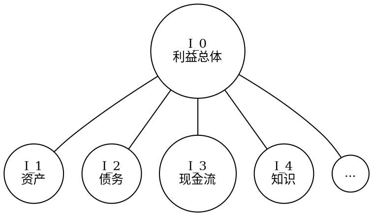

- [利益](#利益)
    - [1. 利益：社会资源](#1-利益社会资源)
        - [1.1. 定义](#11-定义)
        - [1.2. 货币的特殊角色](#12-货币的特殊角色)
    - [2. 利益的细分](#2-利益的细分)
        - [2.1. 细分类别](#21-细分类别)
        - [2.2. 利益细分示意图](#22-利益细分示意图)
    - [3. 配方与调整机制](#3-配方与调整机制)
        - [3.1. 基本配方理论极限](#31-基本配方理论极限)
            - [3.1.1. 配方定义](#311-配方定义)
        - [3.2. 个体配方调整机制](#32-个体配方调整机制)
            - [3.2.1. 配比调整模拟](#321-配比调整模拟)
            - [3.2.2. 配比参数设定](#322-配比参数设定)
        - [3.3. 配方调整的数学表示](#33-配方调整的数学表示)
            - [3.3.1. 下层利益最低比例要求](#331-下层利益最低比例要求)
            - [3.3.2. 个体配比的计算](#332-个体配比的计算)
        - [3.4. 方向性](#34-方向性)
            - [3.4.1. 交易获取上层利益](#341-交易获取上层利益)
            - [3.4.2. 上层利益拆解](#342-上层利益拆解)


# 利益

## 1. 利益：社会资源

### 1.1. 定义
利益 \(I\) 代表一切可占有或可交易的社会资源，现以极坐标形式 \(I(\rho, \theta)\) 来表示，其中 \(\rho\) 表示利益的数量，\(\theta\) 以角度的形式代表利益的种类及其层数。这种表示方式不仅包括物质财富、权力、知识、社会地位等各个层面的资源，也反映了个体或集体在社会中所能够掌握和使用的资源总和。此外，利益超越了单纯的物质资源，涵盖了非物质资源和社会资本等。

```python
class Interest:
    def __init__(self, rho, theta):
        """
        :param rho: 利益的数量
        :param theta: 利益的种类及层数（角度表示）
        """
        self.rho = rho  # 利益的数量
        self.theta = theta  # 利益的种类及层数（角度）

    def __str__(self):
        return f"Interest(quantity={self.rho}, category and layer={self.theta} degrees)"
```

### 1.2. 利益的种类与层数
利益的种类与层数通过 \(\theta\) 的角度表示法绑定，其中角度的精度表示利益的层数，提供了一种自然的方式来表达利益的复杂度和集成程度。基础利益以π的简单整数分数形式出现，而更复杂的利益则通过更精细的分数表示，分母的位数增加来反映更高的层数。

1. **基础利益定义**：系统初始化时，定义一系列基础利益，它们的 \(\theta\) 值使用形如 \(\frac{m}{n} \cdot \pi \) 的分数形式表示，这些利益的层数设定为 1。其中 \[ n \in \mathbb{Z} \cap [1, 9] \] \[ m \in \mathbb{Z} \cap [1, 2n] \]且 \(m\) 和 \(n\) 之间互质，确保每个（基础）利益都有唯一的 \(\theta\) 值表示。基础利益共有52种，每种利益由不同的有理数表示，范围在\( \frac{1}{9} \pi \)到\( 2 \pi \)之间。

### 代码示例：基本利益的种类数

```python
from fractions import Fraction

# 计算基础利益的种类
def calculate_base_interests():
    base_interests = set()
    for denominator in range(1, 10):  # 分母从1到9
        for numerator in range(1, denominator * 2 + 1):  # 分子从1到分母的两倍
            # 创建有理数并进行约分
            interest = Fraction(numerator, denominator).limit_denominator()
            # 添加到集合中，自动处理重复项
            base_interests.add(interest)

    return sorted(base_interests)

# 计算并打印基础利益种类
base_interests = calculate_base_interests()
```

注意到，只要在参与计算时不遗漏 \(\pi\)，系数 \(\frac{m}{n} \) 就足以代表具体的特定角度，这个系数我们记作 \(\alpha\)，称为“利益角系数”（Interest Angle Coefficient，简称 IAC）。

2. **层数增加**：新利益的层数（物质集成度）可以根据其 \(\theta\) 值的分数表示中分母的位数来确定，我们可以使用以下数学形式的逻辑描述：

    - 给定一个利益角系数 \(\alpha = \frac{m}{n}\)，其中 \(m\) 和 \(n\) 是整数，我们可以通过计算分母 \(n\) 的位数来确定该利益的层数 \(L\)。具体来说：

    - 首先定义函数 \(D(n)\) 来计算分母 \(n\) 的位数。例如，如果 \(n = 10\)，则 \(D(10) = 2\)；如果 \(n = 100\)，则 \(D(100) = 3\)。

    - 利益的层数 \(L\) 可以通过计算 \(D(n)\) 来确定。层数 \(L\) 就等于分母 \(n\) 的位数。即：\[ L = D(n) \] 

### 代码示例

```python
import fractions

def calculate_layer(alpha):
    # 将alpha转换为Fraction对象，以获得准确的分数表示
    fraction_alpha = fractions.Fraction(alpha).limit_denominator()
    # 获取分母n
    denominator = fraction_alpha.denominator
    # 计算分母n的位数，即层数L
    L = len(str(denominator))
    
    return L

# 示例：计算alpha值为1/10的利益层数
alpha_example = 1/10
layer_example = calculate_layer(alpha_example)
```

### 1.3. 利益的转换与合成
在模型中，利益的转换和合成通过 \(\rho\) 和 \(\theta\) 的数学运算实现。特别是，新利益的种类（\(\theta\)）可以通过若干个利益的角度运算确定，而其数量（\(\rho\)）则由相应的数学运算决定。这种机制模拟了现实世界中资源的创新和转换。具体方式要参见[配方的概念](世界.md#13-利益配方)

### 1.4. 货币的特殊角色
在极坐标表示的利益模型中，货币作为一种特殊的利益，通过一个唯一确定的角度 \(\theta_{cur}\) 来表示。此角度是根据货币在社会交易中的普遍使用和接受度来确定的，即选择系统中最频繁交易的利益种类的 \(\theta\) 值作为 \(\theta_{cur}\)。这样，货币维持了其作为一般等价物的特殊角色，能够与其他任何利益进行交换。

## 2. 利益的细分

### 2.1. 细分类别
利益的范畴十分广泛，可以根据其性质和功能进一步细分为更具体的类别。例如，物质财富可以细分为资产、债务、现金流等，而每一种又可以依据具体的特征和形态被进一步细分。

### 2.2. 利益细分示意图
为了更直观地理解利益的细分，以下提供了一个示意图。在这个图中，利益 \(I_0\) 被分解为多个子类别 \(I_1, I_2, I_3, I_4, ...\)，每个子类别又可能包含更多的细分。


