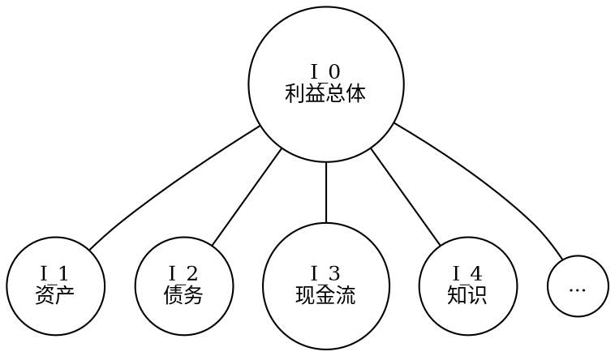
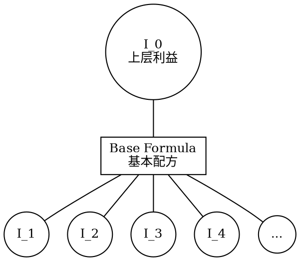

- [利益](#利益)
    - [1. 利益：社会资源](#1-利益社会资源)
        - [1.1. 定义](#11-定义)
        - [1.2. 货币的特殊角色](#12-货币的特殊角色)
    - [2. 利益的细分](#2-利益的细分)
        - [2.1. 细分类别](#21-细分类别)
        - [2.2. 利益细分示意图](#22-利益细分示意图)
    - [3. 配方与调整机制](#3-配方与调整机制)
        - [3.1. 基本配方理论极限](#31-基本配方理论极限)
            - [3.1.1. 配方定义](#311-配方定义)
        - [3.2. 个体配方调整机制](#32-个体配方调整机制)
            - [3.2.1. 配比调整模拟](#321-配比调整模拟)
            - [3.2.2. 配比参数设定](#322-配比参数设定)
        - [3.3. 配方调整的数学表示](#33-配方调整的数学表示)
            - [3.3.1. 下层利益最低比例要求](#331-下层利益最低比例要求)
            - [3.3.2. 个体配比的计算](#332-个体配比的计算)
        - [3.4. 方向性](#34-方向性)
            - [3.4.1. 交易获取上层利益](#341-交易获取上层利益)
            - [3.4.2. 上层利益拆解](#342-上层利益拆解)


# 利益

## 1. 利益：社会资源

### 1.1. 定义
利益 \(I\) 代表一切可占有或可交易的社会资源。这些资源涵盖了物质财富、权力、知识、社会地位等各个层面，反映了个体或集体在社会中所能够掌握和使用的资源总和。由此可见，利益是物质资源 \(R\) 的超集，包括了除物质资源外的其他形式资源，如非物质资源和社会资本等。

```python
class Resource:
    def __init__(self, name, categories, attributes=None):
        self.name = name  # 资源名称
        self.categories = categories  # 资源类别列表
        self.attributes = attributes if attributes is not None else {}

    def add_category(self, category):
        if category not in self.categories:
            self.categories.append(category)

    def add_attribute(self, key, value):
        self.attributes[key] = value

    def get_attribute(self, key):
        return self.attributes.get(key, None)

    def __str__(self):
        return f"Resource(name={self.name}, categories={self.categories}, attributes={self.attributes})"
```

```python
class Interest(Resource):
    def __init__(self, name, amount=0, base_formula=None):
        """
        :param name: 利益的名称
        :param amount: 利益的具体数值
        :param base_formula: 利益对应的基本配方（可选）
        """
        self.name = name
        self.amount = amount
        self.base_formula = base_formula # 后文补充这一概念的定义
```

### 1.2. 货币的特殊角色
货币在所有社会资源中扮演着一种特殊的角色。它作为一般等价物，具备了与其他任何资源交换的能力。这种资源被特别标记为 \(I_{cur}\)。货币的这一特性极大地简化了交易过程，促进了资源的流动和分配，是现代经济体系的基石。

## 2. 利益的细分

### 2.1. 细分类别
利益的范畴十分广泛，可以根据其性质和功能进一步细分为更具体的类别。例如，物质财富可以细分为资产、债务、现金流等，而每一种又可以依据具体的特征和形态被进一步细分。这种细分有助于更准确地理解和分析利益的结构和动态，为决策提供更精细化的依据。

### 2.2. 利益细分示意图
为了更直观地理解利益的细分，以下提供了一个示意图。在这个图中，利益 \(I_0\) 被分解为多个子类别 \(I_1, I_2, I_3, I_4, ...\)，每个子类别又可能包含更多的细分。这种层次化的结构有助于揭示利益的多维度特性和复杂性。



通过这种方式，我们可以清晰地看到不同类型的利益如何从总体中分化出来，并理解各自的特点和相互之间的联系。这为深入分析利益的结构和动态提供了一个有力的工具。

## 3. 配方与调整机制

### 3.1. 基本配方理论极限

#### 3.1.1. 配方定义
在这个框架中，每一种上层利益的构成都可以通过一种“基本配方”来定义。这个配方明确了构成该上层利益所需的各种下层利益及其最低比例要求。这一概念有助于我们理解和量化各种利益之间的构成关系和相互依赖。


```python
class Formula:
    def __init__(self, inputs, output):
        """
        :param inputs: 输入利益及其权重，格式为[(Interest, weight), ...]
        :param output: 输出利益及数量，格式为(Interest, amount)
        """
        self.inputs = inputs
        self.output = output

    def can_apply(self, individual):
        """
        检查个体是否有足够的利益来应用这个配方
        :param individual: 个体实例
        :return: bool
        """
        # 实现细节：遍历inputs，确保个体有足够的对应利益
        pass
```

### 3.2. 个体配方调整机制

#### 3.2.1. 配比调整模拟
个体在特定情况下可能会调整自己的利益配比，以适应特定的需求或目标。这种调整可以通过截断的正态分布来模拟，允许个体在基本配方的基础上进行个性化的微调。

#### 3.2.2. 配比参数设定
在这个模型中，基本配方中的比例（即下层利益在上层利益中的比例）被视为正态分布的均值（μ）。个体具体的利益（如知识水平、技术能力等）可以通过某种映射函数转化为标准差（σ），从而影响个体的利益配比。

### 3.3. 配方调整的数学表示

#### 3.3.1. 下层利益最低比例要求
基本配方中规定了每种下层利益 \(I_i\) 的最低比例要求 \(p_i\)。这是确保上层利益能够成功构成的最低标准。

#### 3.3.2. 个体配比的计算
个体的具体配比 \(p_i'\) 由截断的正态分布决定，其公式如下：
$$ p_i' \sim \text{TruncatedNormal}(\mu = p_i, \sigma, \text{lower} = p_i, \text{upper} = +\infin ) $$ 

其中，下限为 \(p_i\)，确保个体的配比不会低于基本配方的要求，而上限则可以是无穷大，以反映在特定条件下，个体可能会超出最低要求。

### 3.4. 方向性

#### 3.4.1. 交易获取上层利益
此模型允许个体通过市场交易来获取他们无法直接合成的上层利益。这一点强调了交易在资源分配和利益获取中的关键作用。

#### 3.4.2. 上层利益拆解
在需要将上层利益拆解为下层利益进行交易或评估时，如果个体配方中的某些比例无法确定（即为无穷大），则使用基本配方中的标准比例进行计算。这确保了即使在缺乏完整个体配比信息的情况下，也能够进行合理的评估和交易。

